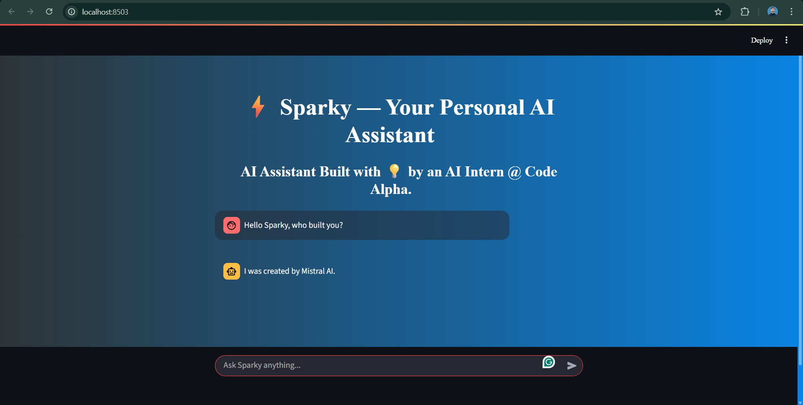

# ⚡ Sparky — Your Personal AI Assistant

**Sparky** is a smart, stylish, and fully functional AI chatbot built using [Streamlit](https://streamlit.io) and powered by [OpenRouter](https://openrouter.ai) large language models (LLMs) like `mistralai/mistral-7b-instruct`. Designed by an Electrical Engineering student and AI intern, this chatbot reflects thoughtful UI design and real-time AI interaction.

---

## 🔧 Features

- 🧠 Chatbot powered by OpenRouter's LLMs
- 💬 Persistent conversation history
- 🎨 Dark cyan gradient UI with Times New Roman font
- 🌀 Wobbly send button animation
- 🔐 Secure API key handling via Streamlit secrets
- ☁️ Ready for deployment on Streamlit Cloud

---

## 📁 Folder Structure

```

AI Chat-bot Task 2/
├── chat\_ui.py              # Main chatbot app
├── styles.css              # Custom styles
├── requirements.txt        # Required packages
└── .streamlit/
└── secrets.toml        # API key (NOT UPLOADED)

````

> ⚠️ `secrets.toml` must **not** be committed to GitHub. Add it locally or in Streamlit Cloud secrets.

---

## 🚀 How to Run Locally

### 🔸 1. Clone the repo

```bash
git clone https://github.com/Bilal-Sikandar/Sparky-Chatbot.git
cd Sparky-Chatbot
````

### 🔸 2. Install dependencies

```bash
pip install -r requirements.txt
```

### 🔸 3. Add your OpenRouter API key

Create a `.streamlit/secrets.toml` file and paste:

```toml
OPENROUTER_API_KEY = "sk-or-xxxxxxxxxxxxxxxxxxxxxxxx"
```

### 🔸 4. Run the app

```bash
streamlit run chat_ui.py
```

---

## 🌐 Deploy on Streamlit Cloud

1. Push this repo to GitHub
2. Go to [streamlit.io/cloud](https://streamlit.io/cloud)
3. Connect your repo
4. In app **Settings → Secrets**, add:

```toml
OPENROUTER_API_KEY = "sk-or-xxxxxxxxxxxxxxxxxxxxxxxx"
```

5. ✅ Done! Share your app’s public link.

---

## 📸 UI Snapshot



---

## 👨‍💻 Built By

**Bilal Sikandar**
Electrical Engineering Student & AI Intern @ Code Alpha
[🔗 LinkedIn](https://linkedin.com/in/bilalsikandar28)

---

